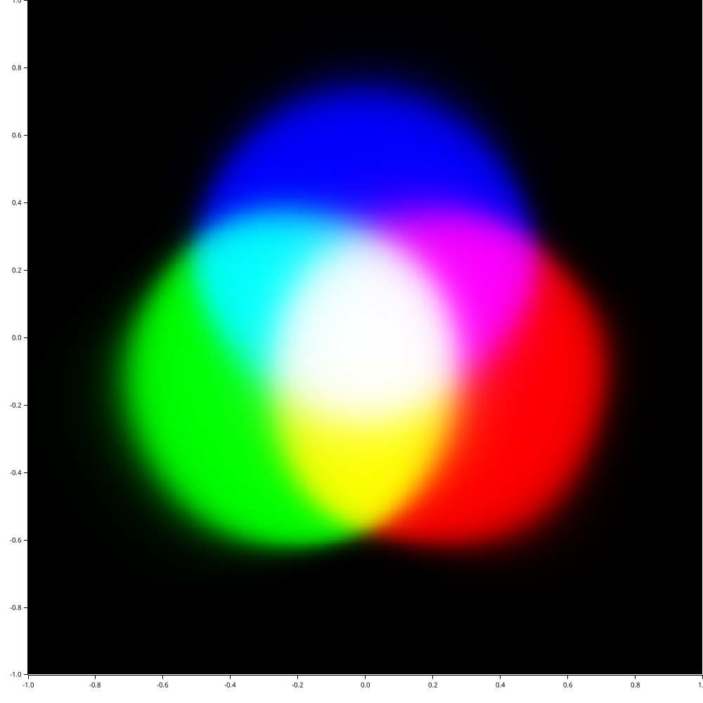
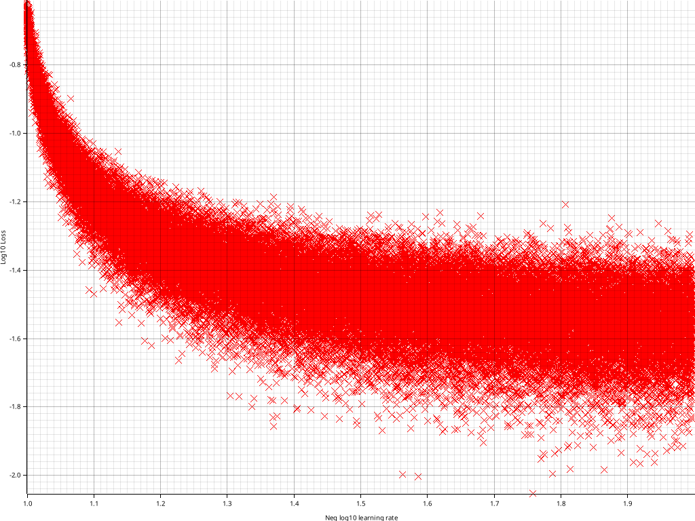

# Project scope
This is my first (except the two rewrites) take on a neural network. It is written with minimal dependencies for fun and educational purposes. It is also my first proper Rust project which added to both the difficulty and the educational value. Documentation available [on GitHub pages](https://drk-ode.github.io/NetNeurons/). It is *not* the new TensorFlow or PyTorch killer :)

# Demos
There are two binaries in the project called **ReText** and **ReColor**. Both use the same underlying code but slightly different. Both can also export and import the values of the trained parameters.

## ReText
This program predicts the next letter based on the previous ones. By default it is trained on a list of names. The names it produces even after extensive training is rubbish, but that was not complete unexpected. It utilises embedding of the characters into arbitrary many dimensions.

## ReColor
This program predicts the colour of a a pair of coordinates. It is trained on rules that defines whether or not coordinates should be red, blue and/or green. Ideally the result should show eight monocoloured regions taking all different overlaps into account. After training two plots are prepared to allow for visual inspection of how well the network was performing. A sample output of ReColor is shown below.

# TODOs
There are many things that are missing or not optimal. More advanced schemes of training and a nicer export and import functions would be next in line for some improvements.
